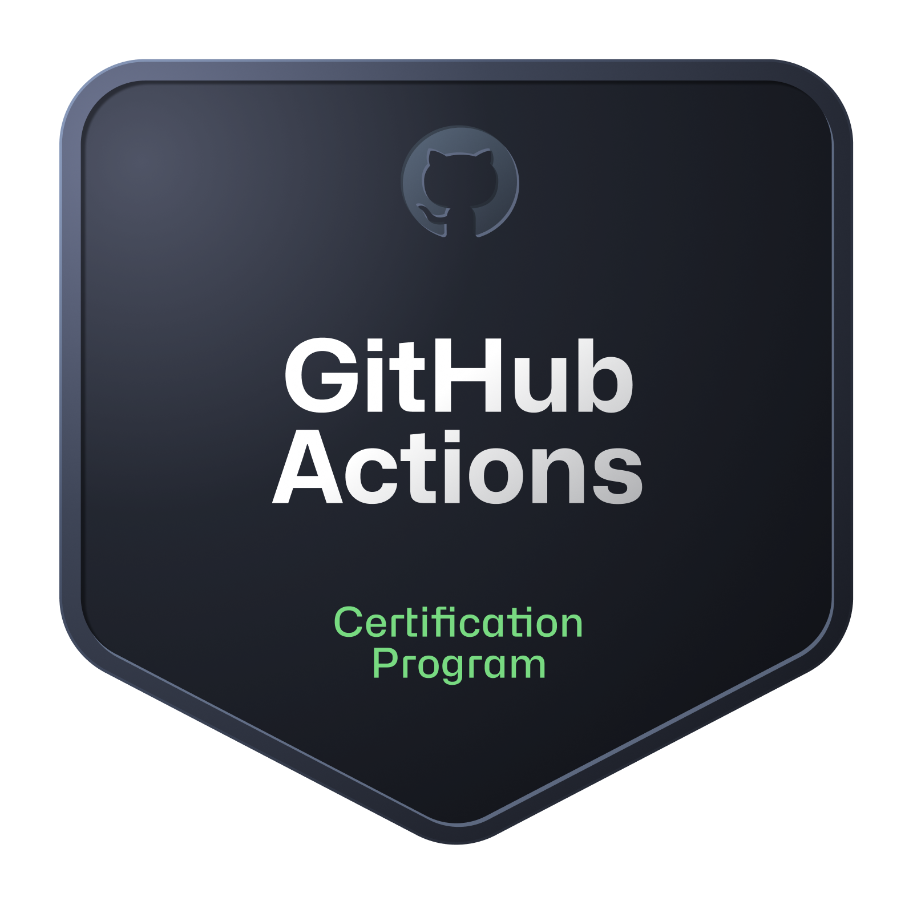

# 👋 Hello! I'm Renan Barbosa  

## 🚀 Software Architect | Senior Tech Lead | AI & Cloud Enthusiast  

  
 
 

---

## 👨‍💻 About Me  
I’m a **Software Architect** and **Senior Tech Lead** from **Minas Gerais, Brazil** 🇧🇷.  
With **14+ years of experience in software development**, I’ve evolved from full-stack developer into a **solution architect** who designs scalable, cloud-native systems.  

I enjoy leading multidisciplinary teams, modernizing legacy applications, and building **future-proof solutions** that combine **solid architecture, AI integration, and cloud-native practices**.  

💡 *“Great architecture balances innovation, simplicity, and long-term value.”*  

---

---

## 🏆 Certifications

  
  
    
    
    
      

## 🛠️ Tech Stack  

 
    <!-- Languages -->
    
    
    
    
    
    
        
    <!-- Frameworks & Libraries -->
    
    
        
    <!-- Databases -->
    
    
    
    
        
    <!-- Cloud & DevOps -->
    
    
    
    
        
    <!-- Tools -->
    
    
    
    
    
    

---

## 🔥 Currently  
- Working as a **Senior Consultant & Software Architect** at Avanade, leading a squad in the banking sector.  
- Pursuing an **MBA in AI Business Leadership**.  
- Developing **EnviroSentinel** 🌱 — an AI-driven startup concept to predict forestry pest outbreaks using ML & climate data.  
- Building **Arch12** 📺, my YouTube channel to share insights on software architecture and cloud-native design.  

---

## 🌟 Featured Projects  

### 🔗 EnviroSentinel (Pitch & Discovery)  
AI-powered platform to **predict forestry pest outbreaks** using climate & historical data.  
**Tech:** Python · ML/AI (Orange, LangChain) · Angular · .NET · Cloud (Azure/Hetzner)  

---

## 📊 GitHub Stats  

  
  

---

## 📖 Daily Dev Quote  

  

---

💬 *Always open to collaboration, knowledge exchange, and new opportunities. Feel free to connect!*  
